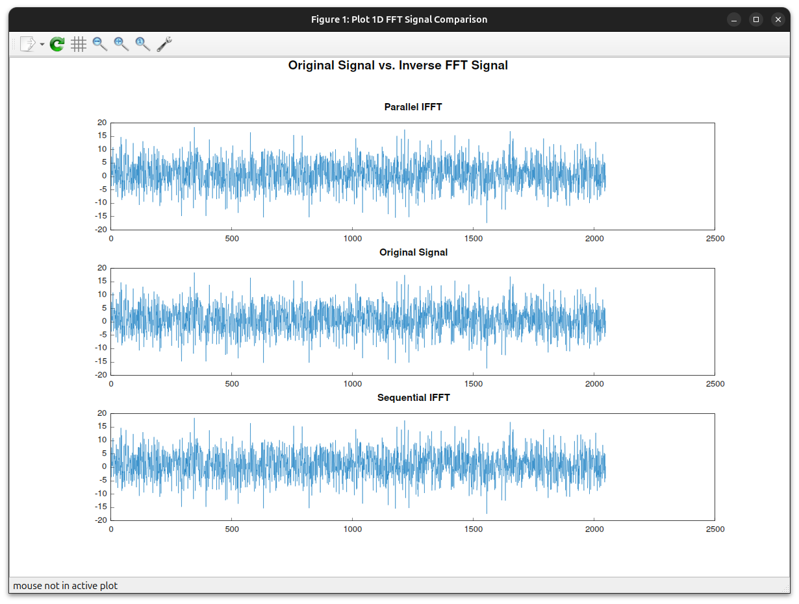
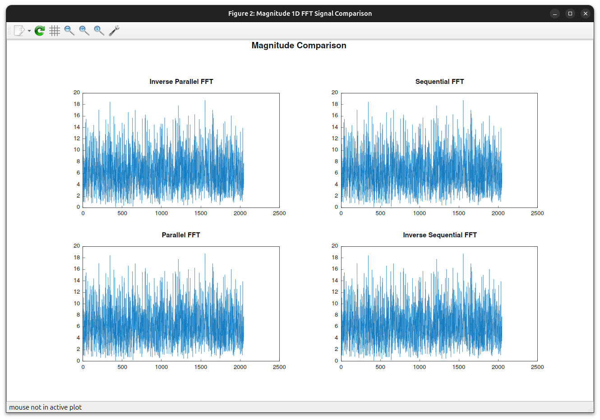
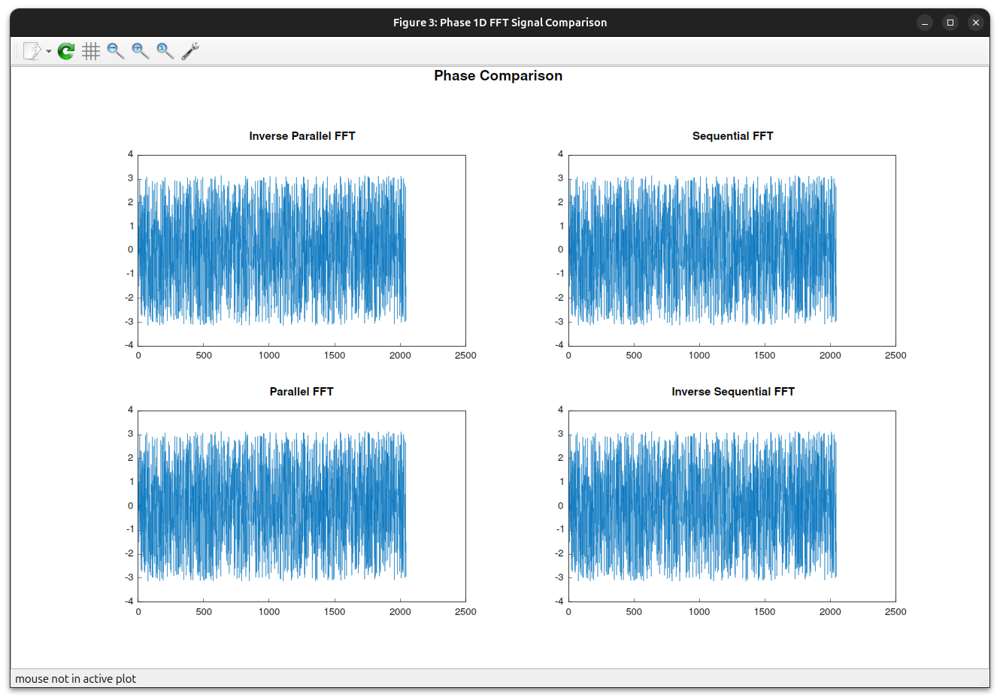

# Fast Fourier Transform (FFT) - Group 20

[](https://www.openmp.org/)

## Table of Contents

- [Description](#description)
  - [Overview](#overview)
    - [Signal Generator](#signal-generator)
    - [Signal Saver](#signal-saver)
    - [Signal Plotter](#signal-plotter)
  - [Cooley-Tukey Algorithm](#cooley-tukey-algorithm)
- [Getting Started](#getting-started)
  - [Prerequisites](#prerequisites)
  - [1. Write a JSON Configuration File](#1-write-a-json-configuration-file)
  - [2. Set the Environment Variable](#2-set-the-environment-variable)
  - [3. Compile and Run the Code](#3-compile-and-run-the-code)
- [Internal Structure](#internal-structure)
  - [Configuration Loader](#configuration-loader)
  - [Signal Generator](#signal-generator-1)
  - [Signal Saver](#signal-saver-1)
  - [Fourier Transform Solver](#fourier-transform-solver)
  - [Utils](#utils)
  - [Main](#main)

------------------------------------------------------------------------------------------------------------------------

## Description

### Overview

The repository provides an implementation of the [Cooley-Tukey algorithm][CK-FFT] for computing
the Fast Fourier Transform (FFT) and its inverse.
The implementation includes both sequential and parallel versions of the algorithm.

The parallel version of the algorithm is implemented using the [OpenMP framework][OpenMP].

#### Signal Generator

The repository also contains a simple signal generator that generates a signal with a given frequency, phase, and noise.
The signal can be represented in the time or space domain.

The main purpose of the signal generator is to provide a signal that can be used as an input to the FFT algorithms.
The signal can be used to test the correctness of the FFT algorithms and to evaluate their performance.

#### Signal Saver

Each generated signal can be saved to a file in CSV format.
If you want another format, you can easily implement your own class that writes the signal to a file.
An abstract class is provided for this purpose: [AbstractFileSignalSaver class][AbstractFileSignalSaver].

#### Signal Plotter

Finally, the repository includes the [matplotplusplus library][matplotplusplus] for plotting:
- The original signal against the inverse FFT of the original signal's FFT.
  
- The magnitude of the FFT of the original signal using the sequential and parallel versions of the algorithm.
  
- The phase of the FFT of the original signal using the sequential and parallel versions of the algorithm.
  

### Cooley-Tukey Algorithm

In short, the Cooley-Tukey algorithm is a divide-and-conquer algorithm that recursively
decomposes a Discrete Fourier Transform (DFT) of any composite
size $N = N_1 \cdot N_2$ into smaller DFTs of sizes $N_1$ and $N_2$, along with some multiplicative factors.
The algorithm is particularly efficient for composite sizes such as powers of 2, 3, 4, 5, etc.

Although the original Cooley-Tukey algorithm is a recursive algorithm,
the implementation provided in this repository is an iterative version of the algorithm.
The iterative version is more efficient than the recursive version because it avoids the overhead of function calls.

The Cooley-Tukey algorithm has a time complexity of $O(N \log N)$ and a space complexity of $O(N)$.

------------------------------------------------------------------------------------------------------------------------

## Getting Started

### Prerequisites

> [!IMPORTANT]  
> The code has been tested on the Linux operating system. We do not guarantee that it will run correctly.
> 
> However, it should work on other operating systems as well,
> since the code is written in standard C++20 and the [gnuplot library][gnuplot]
> is available for various operating systems.
> 
> If you have problems with [gnuplot][gnuplot], you can easily avoid using it by commenting out the code that uses it.

To run the code, you need to have the following installed on your system:
- A C++ compiler that supports the C++20 standard.
- The [CMake](https://cmake.org/) and [Make](https://www.gnu.org/software/make/) build tools.
  The minimum required `CMake` version is `3.28`.
- The [OpenMP](https://www.openmp.org/) framework.
- The [gnuplot library][gnuplot] (for [matplotplusplus][matplotplusplus]).
  On Linux, you can install it with the following command:
  ```bash
  sudo apt-get install gnuplot
  ```

To clone the repository, you need to have the [Git](https://git-scm.com/)
version control system installed on your system.

The repository can be cloned using the following command:
```bash
git clone --recursive https://github.com/AMSC-24-25/20-fft-20-fft.git
```

> [!NOTE]  
> If you have already cloned the repository without the `--recursive` flag,
> you can clone the submodules using the following command (from the repository folder):
> ```bash
> git submodule update --init --recursive
> ```

------------------------------------------------------------------------------------------------------------------------

### 1. Write a JSON Configuration File

To configure the simulation, you need to:

1. Create a JSON file with the following parameters:
    - `signal_length`. The length of the signal. Specifies the number of samples or data points in the signal.
                       **It must be a power of 2 integer**.
    - `signal_domain`. The domain of the signal (_time_ or _space_).
    - `hz_frequency`. Represents the frequency of the signal's oscillations. It depends on the signal domain.
                      For example, it refers to the number of cycles per second (hertz) in the time domain,
                      and it indicates spatial frequency (or the number of cycles per unit distance)
                      in the spatial domain.
    - `phase`. The phase of the signal.
               It represents the initial angle of the sine or cosine function at time $t = 0$,
               or the shift of the signal waveform.
    - `noise`. Thanks to the noise parameter, the signal can be randomly distorted.
               In addition, the noise guarantees a more realistic signal generation. \
               The random generation is based on a Gaussian distribution with a mean of 0 and a standard deviation equal to the noise.
               The mean ($\mu$) is 0, so the noise is centered around zero and does not distort the signal.
               The standard deviation ($\sigma$) is equal to the noise because it determines
               how the noise values are spread around the mean. \
               Approximately 68% of the noise values will fall within $\pm \sigma$ of the mean,
               95% will fall within $\pm 2 \sigma$,
               and 99.7% will fall within $\pm 3 \sigma$.
    - `seed`. Seed for the random number generator (optional, if you want to make the simulation reproducible).
2. Set the environment variable to point to the JSON file.
   The name of the environment variable is `CONFIG_FILE_PATH_FFT`.
   If you don't set the environment variable,
   the simulation will use a sample configuration file: [sample-config.json](resources/sample-config.json);
   and the program will print a warning message.

> **Example: JSON Configuration File**
>
> ```json
> {
>   "signal_domain": "time",
>   "signal_length": 2048,
>   "hz_frequency": 5,
>   "phase": 0,
>   "noise": 5
> }
> ```
>
> An example of JSON file that describes a signal with the following characteristics:
> - **Signal Domain**: `"time"` - The signal is represented in the time domain.
> - **Signal Length**: `2048` - The duration or length of the signal (number of samples).
> - **Frequency**: `5 Hz` - The frequency of the signal in Hertz (cycles per second).
> - **Phase**: `0` - The phase shift of the signal, which is 0 in this case.
> - **Noise**: `5` - The noise level or amplitude of noise in the signal.
>
> In short, the configuration describes a time domain signal with a frequency of `5 Hz`,
> no phase shift, and an amount of noise (`5`).

In the [resources/json-schema folder](resources/json-schema),
you can find the JSON schema that you can use to easily validate/write the JSON configuration file.

> [!WARNING]
> Unfortunately, the JSON schema is not used in the code yet because
> we should install external libraries to validate the JSON file (not necessary at the moment).
> Therefore, the JSON should be validated manually.

> [!TIP]
> If you are not familiar with JSON Schema, you can use the following website validator to validate your JSON file:
> [JSON Schema Validator][JSONSchemaValidator].
> You need to copy the [contents of the JSON schema file](resources/json-schema/json-schema.json) on the left
> and the contents of your JSON file on the right (the validation is done automatically).

------------------------------------------------------------------------------------------------------------------------

### 2. Set the Environment Variable

The simulation uses the environment variable `CONFIG_FILE_PATH_FFT` to read the JSON configuration file.

If it is not set, the simulation will use a sample configuration file:
[sample-config.json](resources/sample-config.json).

However, to set the environment variable, you can use the following command:
- On Linux or macOS:
  ```bash
  export CONFIG_FILE_PATH_FFT=/path/to/your/json/file.json
  ```
- On Windows:
  ```cmd
  set CONFIG_FILE_PATH_FFT=\path\to\your\json\file.json
  ```

The path to the JSON file can be absolute or relative to current working directory.

------------------------------------------------------------------------------------------------------------------------

### 3. Compile and Run the Code

To run the code, you need to compile the code using the provided [CMakeLists.txt file](CMakeLists.txt).

If you are a student at the [Politecnico di Milano][POLIMI],
you can easily use the [MK Library][MK library] (provided by the [MOX Laboratory][MOX Laboratory]) to compile the code.

In the [CMakeLists.txt file](CMakeLists.txt), you can find the following lines that include the [MK library][MK library]:
```cmake
include_directories(
        /u/sw/toolchains/gcc-glibc/11.2.0/base/include
        # To include the Eigen library:
        # /u/sw/toolchains/gcc-glibc/11.2.0/pkgs/eigen/3.3.9/include/eigen3
        # To include the LIS library:
        # /u/sw/toolchains/gcc-glibc/11.2.0/pkgs/lis/2.0.30/include
)
```
If you don't want to use the MK library, you can comment out the lines containing the MK library.

If you have [CLion][CLion] installed, this is a simple story. Just open the project and run the code using the provided
[CMakeLists.txt file](CMakeLists.txt). On the right side of the CLion window you can see the available executables.

Otherwise, you can compile the code using the command line.
1. Compile the CMakeFiles:
   ```bash
   cd 20-fft-20-fft # repository folder
   cmake . # where the CMakeLists.txt file is located
   ```
   After running the above command, you will see the Makefile in the repository folder.
   This Makefile contains the necessary commands to compile the code.
   Since the Makefile is generated automatically, you don't need to edit it.
   If you want to edit the Makefile, you can do so by modifying the file [CMakeLists.txt](CMakeLists.txt).
2. Compile all possible executables with the following command:
   ```bash
   # assuming you are in the repository folder where the CMakeLists.txt file is located
   make -f ./Makefile -C . all
   ```
   > [!TIP] 
   > Most likely you have a multi-core processor.
   > Since the build needs to compile the `matplotplusplus` library,
   > we strongly recommend using the `parallel_build` command. So you can use the following command:
   > ```bash
   > make -f ./Makefile -C . parallel_build
   > ```
3. Set the environment variable:
   ```bash
   export CONFIG_FILE_PATH_FFT=/path/to/your/json/file.json
   ```
   or
   ```cmd
   set CONFIG_FILE_PATH_FFT=\path\to\your\json\file.json
   ```
4. And finally, run one of the compiled codes:
   ```bash
   # assuming you are in the repository folder where the CMakeLists.txt file is located
   ./main
   # and so on...
   ```
5. Clean the compiled files:
   ```bash
   # assuming you are in the repository folder where the CMakeLists.txt file is located
   make -f ./Makefile -C . clean
   ```

------------------------------------------------------------------------------------------------------------------------

## Internal Structure

The repository is organized as follows:
- The [external folder](external) contains the external libraries.
  At the moment, there are two external libraries:
    - The [matplotplusplus library](external/matplotplusplus) for plotting.
    - The [nlohmann/json library](external/nlohmann) for working with JSON files.
- The [include folder](include) contains the header files.
- The [resources folder](resources) contains the resources used by the code.
  It includes the [sample configuration file](resources/sample-config.json) and
  the [JSON schema](resources/json-schema/json-schema.json).
- The [docs folder](docs) contains the documentation.
- The [src folder](src) contains the source files.

The project is divided into six main parts.

------------------------------------------------------------------------------------------------------------------------

### Configuration Loader

The [configuration loader](src/config-loader) is responsible for loading the configuration from the JSON file.

It contains the following classes:
- The [AbstractConfigurationLoader class](include/config-loader/abstract-configuration-loader.hpp) is an abstract class
  that defines the interface for loading the configuration.
- The [JsonConfigurationLoader class](include/config-loader/json-configuration-loader.hpp) is a concrete class
  that loads the configuration from a JSON file. The implementation is on the
  [json-configuration-loader.cpp file](src/config-loader/json-configuration-loader.cpp).
- The [JsonFieldHandler class](include/config-loader/json-field-handler.hpp)
  is a utility class that provides field names for the JSON configuration file.
  It also provides methods to retrieve the field values from the JSON configuration file.
  There is also a enumeration class used to define the field names.
  The validation method verifies that the JSON configuration file is correct (because the JSON schema is not used yet).
  Finally, the implementation is on the [json-field-handler.cpp file](src/config-loader/json-field-handler.cpp).

------------------------------------------------------------------------------------------------------------------------

### Signal Generator

The [signal generator](src/signal-generator) is responsible for generating a random signal.

It contains the following classes:
- The [AbstractSignalGenerator class](include/signal-generator/abstract-signal-generator.hpp) is an abstract class
  that defines the interface for generating a signal.

  It contains a `_seed` field which is used to make the simulation reproducible. If the seed is not set,
  the [std::random_device](https://en.cppreference.com/w/cpp/numeric/random/random_device) is used.
  The random device is a random number generator that produces non-deterministic random numbers.

  Also, the random engine used is the [std::mt19937][mt19937], which is a Mersenne Twister pseudorandom generator.
  It generates 32-bit pseudo-random numbers using the well-known and popular Mersenne Twister algorithm.
  The word mt19937 stands for Mersenne Twister with a long period of $2^{19937} - 1$, which means that mt19937 produces
  is a sequence of 32-bit integers that repeats only after $2^{19937} - 1$ numbers have been generated.

- The [TimeDomainSignalGenerator class](include/signal-generator/time-domain-signal-generator.hpp) is a concrete class
  that generates a signal in the time domain.
  To see the documentation of the method that generates the signal, you can see the
  [header file](include/signal-generator/time-domain-signal-generator.hpp).
  Instead, the implementation is on the
  [time-domain-signal-generator.cpp file](src/signal-generator/time-domain-signal-generator.cpp).

- Finally, the [SpaceDomainSignalGenerator class](include/signal-generator/space-domain-signal-generator.hpp)
  is a concrete class that generates a signal in the space domain.
  To see the documentation of the method that generates the signal, you can see the
  [header file](include/signal-generator/space-domain-signal-generator.hpp).
  Instead, the implementation is on the
  [space-domain-signal-generator.cpp file](src/signal-generator/space-domain-signal-generator.cpp).

------------------------------------------------------------------------------------------------------------------------

### Signal Saver

The [signal saver](src/signal-saver) is responsible for saving the generated signal to a file.

It contains the following classes:
- The [AbstractSignalSaver class](include/signal-saver/abstract-file-signal-saver.hpp) is an abstract class
  that defines the interface for saving the signal to a file.
- The [CsvSignalSaver class](include/signal-saver/csv-signal-saver.hpp) is a concrete class
  that saves the signal to a CSV file.
  The implementation is on the [csv-signal-saver.cpp file](src/signal-saver/csv-signal-saver.cpp).

Other classes can be implemented to save the signal to other file formats.

------------------------------------------------------------------------------------------------------------------------

### Fourier Transform Solver

The [Fourier transform solver](src/fourier-transform-solver) is responsible for solving the Fourier transform.

It contains the following classes:
- The [AbstractFourierTransformSolver class](include/fourier-transform-solver/abstract-fourier-transform-solver.hpp)
  is an abstract class that defines the interface for solving the Fourier transform.
  The constructor takes the vector signal as a parameter.
- Sequential Solver:
  - The [Sequential1DFastFT class](include/fourier-transform-solver/sequential-1d-fast-ft.hpp)
    is a concrete class that solves the Fourier transform sequentially.
    The implementation is on the
    [sequential-1d-fast-ft.cpp file](src/fourier-transform-solver/sequential-1d-fast-ft.cpp).
  - The [Sequential1DInverseFastFT class](include/fourier-transform-solver/sequential-1d-inverse-fast-ft.hpp)
    is a concrete class that solves the inverse Fourier transform sequentially.
    The implementation is on the
    [sequential-1d-inverse-fast-ft.cpp file](src/fourier-transform-solver/sequential-1d-inverse-fast-ft.cpp).
- Parallel Solver:
  - The [Parallel1DFastFT class](include/fourier-transform-solver/parallel-1d-fast-ft.hpp)
    is a concrete class that solves the Fourier transform in parallel using the [OpenMP framework][OpenMP].
    The implementation is on the
    [parallel-1d-fast-ft.cpp file](src/fourier-transform-solver/parallel-1d-fast-ft.cpp).
  - The [Parallel1DInverseFastFT class](include/fourier-transform-solver/parallel-1d-inverse-fast-ft.hpp)
    is a concrete class that solves the inverse Fourier transform in parallel using the [OpenMP framework][OpenMP].
    The implementation is on the
    [parallel-1d-inverse-fast-ft.cpp file](src/fourier-transform-solver/parallel-1d-inverse-fast-ft.cpp).

------------------------------------------------------------------------------------------------------------------------

### Utils

The [utils](src/utils) folder contains utility methods that are used by the other classes.

The two main implementations are:
- The bit reversal method that is used to reorder the signal before solving the Fourier transform.
  There are two implementations:
  - The sequential implementation is used by the sequential solver.
  - The parallel implementation is used by the parallel solver.
  The implementation is on the [bit-reversal.cpp file](src/utils/bit-reversal.cpp) and
  the header file is [bit-reversal.hpp](include/utils/bit-reversal.hpp).
- The timestamp method that is used to create a readable timestamp.
  The implementation is on the [timestamp.cpp file](src/utils/timestamp.cpp) and
  the header file is [timestamp.hpp](include/utils/timestamp.hpp).

------------------------------------------------------------------------------------------------------------------------

### Main

The [main](src/main.cpp) file is the entry point of the program.

We give a brief overview of the main file just for clarity, but the class hierarchy is the most important part.
This file is a simple example of how to use the classes provided in the repository.

The main file contains the following steps:
1. **Configuration Loading**.
   1. Check if the environment variable `CONFIG_FILE_PATH_FFT` is set.
   2. Load the configuration from the JSON file.
2. **Generate Signal**.
   1. Generate the signal using the configuration.
   2. Save the signal to a file.
   3. Prepare the signal vectors for the Fourier transform.
3. **Sequential FFT**. Solve the Fourier transform sequentially.
4. **Parallel FFT**. Solve the Fourier transform in parallel.
5. **Sequential Inverse FFT**. Solve the inverse Fourier transform sequentially.
6. **Parallel Inverse FFT**. Solve the inverse Fourier transform in parallel.
7. **Plotting**.
   1. Plot the original signal against the inverse FFT of the original signal's FFT.
   2. Plot the magnitude of the FFT of the original signal using the sequential and parallel versions of the algorithm.
   3. Plot the phase of the FFT of the original signal using the sequential and parallel versions of the algorithm.

------------------------------------------------------------------------------------------------------------------------


[OpenMP]: https://www.openmp.org/
[POLIMI]: https://www.polimi.it/
[CLion]: https://www.jetbrains.com/clion/
[CK-FFT]: https://en.wikipedia.org/wiki/Cooley%E2%80%93Tukey_FFT_algorithm
[MOX Laboratory]: https://mox.polimi.it/
[MK library]: https://github.com/pcafrica/mk
[JSONSchemaValidator]: https://www.jsonschemavalidator.net/
[matplotplusplus]: https://alandefreitas.github.io/matplotplusplus/
[AbstractFileSignalSaver]: include/signal-saver/abstract-file-signal-saver.hpp
[gnuplot]: http://gnuplot.info/
[mt19937]: https://en.cppreference.com/w/cpp/numeric/random/mersenne_twister_engine