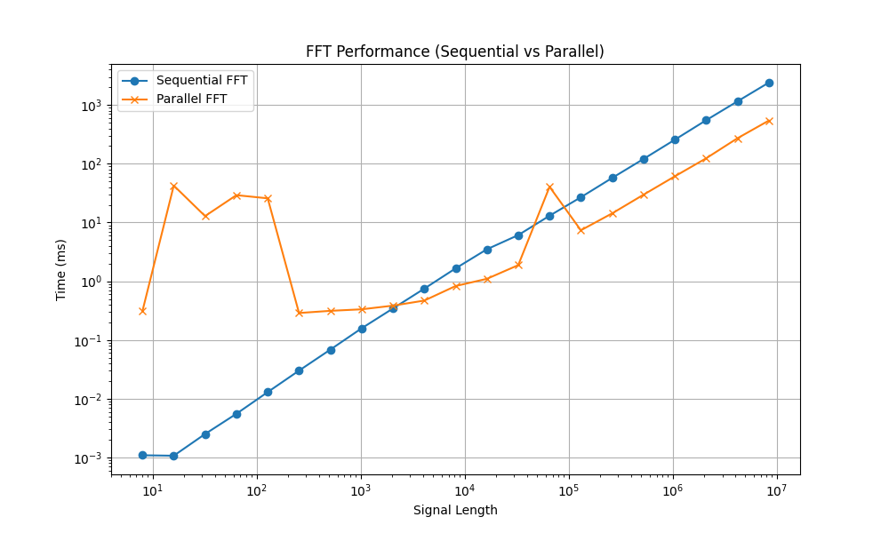
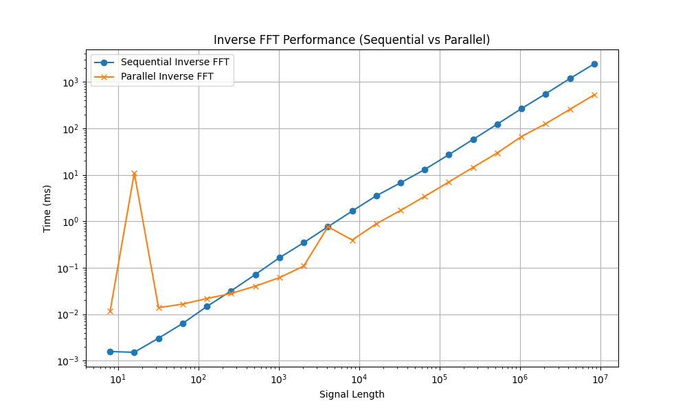
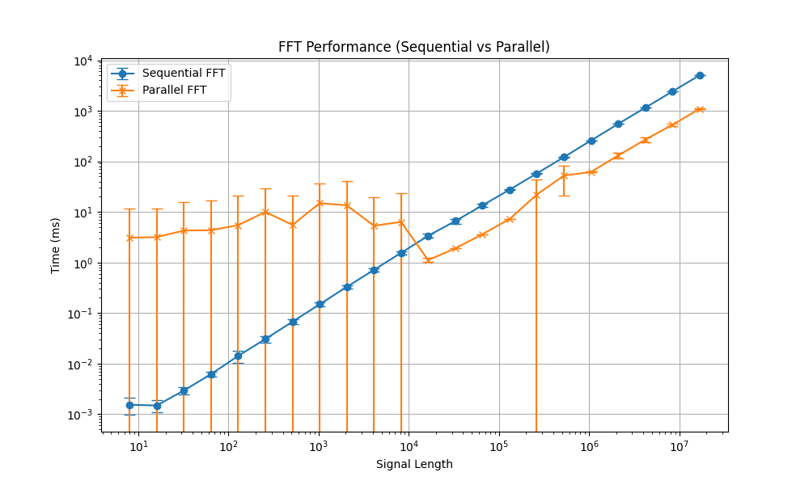
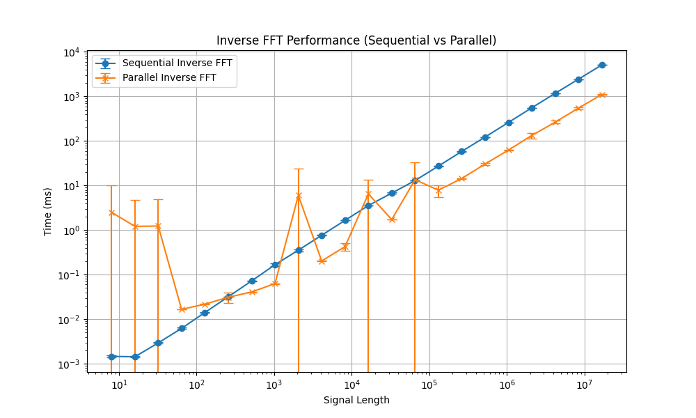

# Signal Processing

## Fast Fourier Transform (FFT) - Group 20

[](https://www.openmp.org/)
[](https://cmake.org/)
[](https://en.cppreference.com/w/cpp/20)
[](LICENSE)

### For the impatient

Only OpenMP, CMake 3.22 and C++20 are required.
- For those who want to use the library:
    ```bash
    git clone --recursive-submodules https://github.com/AMSC-24-25/20-fft-20-fft.git
    # rename folder clone
    mv 20-fft-20-fft signal_processing
    ```
  You can add the following lines to `CMakeLists.txt`:
    ```cmake
    # suppose you have cloned the repository into an external folder
    add_subdirectory(external/signal_processing)
    target_link_libraries(your_executable_name PRIVATE signal_processing)
    ```
- For those who want to run examples or benchmarks:
    ```bash
    git clone --recursive-submodules https://github.com/AMSC-24-25/20-fft-20-fft.git
    # rename folder clone
    mv 20-fft-20-fft signal_processing && cd signal_processing
    ./build-essentials.sh # to install the dependencies
    ./build-examples.sh   # to build the examples
    ./build-benchmarks.sh  # to build the benchmarks
    ```

---

## Table of Contents

  - [Description](#description)
    - [Overview](#overview)
    - [Fourier Transform and Cooley-Tukey Algorithm](#fourier-transform-and-cooley-tukey-algorithm)
    - [Discrete Cosine Transform Type-II (DCT-II) and DCT-III (Inverse DCT)](#discrete-cosine-transform-type-ii-dct-ii-and-dct-iii-inverse-dct)
    - [Haar Wavelet Transform (HWT)](#haar-wavelet-transform-hwt)
  - [Getting Started](#getting-started)
    - [Prerequisites](#prerequisites)
    - [1. Write a JSON Configuration File](#1-write-a-json-configuration-file)
    - [2. Set the Environment Variable](#2-set-the-environment-variable)
    - [3. Compile and Run the Code](#3-compile-and-run-the-code)
  - [Internal Structure](#internal-structure)
    - [Configuration Loader](#configuration-loader)
    - [Signal Generator](#signal-generator-1)
    - [Signal Saver](#signal-saver-1)
    - [Fourier Transform Solver](#fourier-transform-solver)
    - [Utils](#utils)
    - [Main](#main)
  - [Benchmark](#benchmark)
    - [FFT Performance](#fft-performance)
    - [Inverse FFT Performance](#inverse-fft-performance)
    - [Standard Deviation](#standard-deviation)
      - [FFT](#fft)
      - [Inverse FFT](#inverse-fft)

------------------------------------------------------------------------------------------------------------------------

## Description

### Overview

The Signal Processing library is a C++ educational project implementing famous transform algorithms.

The transforms implemented in this repository are:
- The [Fast Fourier Transform (FFT)](#fourier-transform-and-cooley-tukey-algorithm)
  and its inverse are both implemented in parallel using the [OpenMP framework][OpenMP]
  and in sequential.
  The implementation is based on the [Cooley-Tukey algorithm][CK-FFT].
  It **supports N-dimensional signals**, but obviously the signal length must be a power of 2 (radix-2 case).
- The [Discrete Cosine Transform (DCT)](#discrete-cosine-transform-type-ii-dct-ii-and-dct-iii-inverse-dct)
  and its inverse are both implemented in parallel using the
  [OpenMP framework][OpenMP] and in sequential.
  The DCT is implemented as DCT-II (type II), and its inverse is implemented as DCT-III (type III).
  It is believed to be used for image compression.
- The [Haar Wavelet Transform (HWT)](#haar-wavelet-transform-hwt) (only sequential).

Furthermore, the DCT and the HWT are implemented for image compression.

---

### Fourier Transform and Cooley-Tukey Algorithm

The Fourier transform is a mathematical operation that transforms a function of time (or space) into a function of frequency.
In this library, we implement the Fast Fourier Transform (FFT) algorithm,
and its inverse (IFFT) using the Cooley-Tukey algorithm (Radix-2 case).

The **Cooley-Tukey algorithm** is a (famous) algorithm for computing the **Fast Fourier Transform (FFT)** efficiently.
It reduces the computational complexity of the **Discrete Fourier Transform (DFT)** from $O(N^2)$ to $O(N \log N)$,
where $N$ is the number of data points.

Under the hood, the Cooley-Tukey algorithm uses the **divide-and-conquer** strategy.
It recursively breaks a DFT of size $N$ into several smaller DFTs, computes them, and then combines the results.
Precisely, it decomposes a DFT of size $N$ into two smaller DFTs: $N = N_1 \cdot N_2$;
then it reuses the results with **twiddle factors** (complex exponential factors) to combine them:

$$
X(k) = \sum_{n=0}^{N-1} x(n) e^{(-2\pi i k n) \div N} = \sum_{m=0}^{N_1-1} X_1(m) W_N^{km} + \sum_{m=0}^{N_2-1} X_2(m) W_N^{km}
$$

- $X(k)$ is the $k$-th component of the Discrete Fourier Transform (DFT), representing the frequency domain.
- $\displaystyle\sum_{n=0}^{N-1}$ is the summation over all $N$ input samples.
- $x(n)$ is the $n$-th sample of the input signal in the time (or spatial) domain.
- $e^{(-2\pi i k n) \div N} = \exp((-2\pi i k n) \div N)$ is the complex exponential
  (**twiddle factor**) that maps the time-domain signal
  to the frequency domain. It introduces a phase shift and scales the input signal.

When $N$ is a power of 2 ($N = 2^m$), the algorithm becomes very simple and efficient.
And this is the case we implement in this repository. Also called **Radix-2 Cooley-Tukey FFT**.
The algorithm is divided into two main steps:
1. **Bit-reversal permutation**: reorder the input array based on the bit-reversed indices
   (see also [Wikipedia][bit-reversal]).
2. **Iteratively compute FFT**:
   1. Start with 2-point DFTs.
   2. Merge results into 4-point DFTs, then 8-point, and so on, up to $N$-point.

Each stage computes [**butterfly operations**][butterfly],
which involve two elements $a$ and $b$, using a twiddle factor $W\_N^k$.

Finally, for the **inverse FFT**, the algorithm is similar but with a few differences:
1. The **direction of the twiddle factor** in the inverse FFT is reversed.

$$
W_N^{-k} = e^{(2\pi i k) \div N}
$$

2. After computing the inverse FFT using Cooley-Tukey, we **normalize the result**.
   Each element is divided by $N$, the size of the input.

$$
x_n = \frac{1}{N} \sum_{k=0}^{N-1} X_k \cdot e^{(2\pi i kn) \div N}
$$

   This scaling ensures that the inverse transform truly inverts the original FFT and restores the original signal.


> [!WARNING]
> The Cooley-Tukey algorithm implemented in this repository is the **Radix-2** case.
> So the signal length must be a power of 2.


---

### Discrete Cosine Transform Type-II (DCT-II) and DCT-III (Inverse DCT)


The **Discrete Cosine Transform Type-II (DCT-II)** is the most commonly used variant of the DCT,
particularly in image and video compression (e.g. JPEG). It is defined as:

$$
X_k = \alpha_k \sum_{n=0}^{N-1} x_n \cos\left(\dfrac{\pi(2n+1)k}{2N}\right), \quad k = 0, 1, ..., N-1
$$

Where:
- $x_n$: input signal (spatial or time domain)
- $X_k$: DCT coefficient (frequency domain)
- $N$: number of input samples
- $\alpha_k$: normalization factor:
  
$$
\alpha_k =
\begin{cases}
\sqrt{\frac{1}{N}} & \text{if } k = 0 \\
\sqrt{\frac{2}{N}} & \text{if } k > 0
\end{cases}
$$


The cosine argument determines the basis functions. It’s the **heart of the transform**:

- $k$ determines the **frequency** of the cosine wave: higher $k$ means more oscillations.
- $(2n+1)$ causes the cosine to **sample at odd intervals**,
  which makes it suitable for even symmetry extension
  (fundamental for avoiding boundary discontinuities in signals/images).


In other words, the DCT basis functions are cosine waves of increasing frequency.


The summation is an **inner product** between the input signal and the cosine basis function of frequency $k$.
It measures "how much of that frequency" is present in the signal.


Finally, the **normalization factor** $\alpha_k$ ensures **energy preservation** and
makes the transform **orthonormal**:

- $\alpha_0 = \sqrt{\frac{1}{N}}$ gives the DC term (average value) less weight.
- $\alpha_k = \sqrt{\frac{2}{N}}$ for $k > 0$ keeps other frequencies properly scaled.


Finally, the **DCT-III**, which is the inverse of the DCT-II, is defined as:

$$
x_n = \sum_{k=0}^{N-1} \alpha_k X_k \cos\left[\frac{\pi(2n+1)k}{2N}\right]
$$


In general, the DCT is used for compression because it focuses the signal's energy into a few coefficients.
This allows for efficient representation and storage.
In this library, we use DCT-II and DCT-III for image compression.
These methods are supported by [quantization][quantization], [zigzag scanning][zigzag], and [RLE encoding][rle]
(unfortunately [Huffman encoding][Huffman] is not implemented yet).


---

### Haar Wavelet Transform (HWT)

The **1D Haar Wavelet Transform** (HWT) is one of the simplest wavelet transforms.
It is very useful for signal compression (our goal), denoising, and multi-resolution analysis.

The Haar transform converts a sequence of values into **averages and differences**,
capturing both **low-frequency (smooth)** and **high-frequency (detail)** information.

The 1D Haar transform is defined as follows. Given an input vector:

$$
x = [x_0, x_1, x_2, x_3, \dots, x_{N-2}, x_{N-1}]
$$

The transform produces two outputs:
1. **Averages** (_low_-frequency content):

$$
a_i = \frac{x_{2i} + x_{2i+1}}{\sqrt{2}}
$$

2. **Details** (_high_-frequency content):

$$
d_i = \frac{x_{2i} - x_{2i+1}}{\sqrt{2}}
$$


> [!TIP]
> For example, for $x = [4, 6, 10, 12]$:
>
> $$
  \begin{aligned}
  a_0 &= \frac{4 + 6}{\sqrt{2}} = \frac{10}{\sqrt{2}} \\
  a_1 &= \frac{10 + 12}{\sqrt{2}} = \frac{22}{\sqrt{2}} \\
  d_0 &= \frac{4 - 6}{\sqrt{2}} = \frac{-2}{\sqrt{2}} \\
  d_1 &= \frac{10 - 12}{\sqrt{2}} = \frac{-2}{\sqrt{2}} \\
  \end{aligned}
  $$
>
> So the Haar transform of `x` is:
> 
> $$
  \text{HWT}(x) = [a_0, a_1, d_0, d_1] = \left[\frac{10}{\sqrt{2}}, \frac{22}{\sqrt{2}}, \frac{-2}{\sqrt{2}}, \frac{-2}{\sqrt{2}}\right]
  $$

Our implementation is a multilevel Haar transform, which means it is recursive.
We apply the transform to the **average coefficients only**, creating a **pyramid of resolutions**.
This is known as the **Haar wavelet decomposition**, and it outputs are:
* low-frequency coefficients (averages)
* high-frequency coefficients (details)


> [!TIP]
> Taking in account the example above, the first level of the Haar transform (level 1) gives:
> 
> $$
[\underbrace{a_0, a_1}\_{\text{averages}}, \underbrace{d_0, d_1}\_{\text{details}}] = \left[\frac{10}{\sqrt{2}}, \frac{22}{\sqrt{2}}, \frac{-2}{\sqrt{2}}, \frac{-2}{\sqrt{2}}\right]
  $$
> 
> Then, you can apply the Haar transform again on the averages from level 1:
> 
> $$
\left[\frac{10}{\sqrt{2}}, \frac{22}{\sqrt{2}}\right]
  $$
> 
> Again, compute average and detail (level 2):
> 
> $$
\begin{aligned}
a_{00} &= \frac{\frac{10}{\sqrt{2}} + \frac{22}{\sqrt{2}}}{\sqrt{2}} = \frac{32}{2} = 16 \\
d_{00} &= \frac{\frac{10}{\sqrt{2}} - \frac{22}{\sqrt{2}}}{\sqrt{2}} = \frac{-12}{2} = -6
\end{aligned}
  $$
> 
> After **2 levels**, we get:
> 
> $$
[\underbrace{a_{00}}\_{\text{lowest frequency}}, \underbrace{d_{00}}\_{\text{medium detail}}, \underbrace{d_0, d_1}\_{\text{finest details}}] = [16, -6, -\frac{2}{\sqrt{2}}, -\frac{2}{\sqrt{2}}]
  $$
> 
> Where $a_{00}$ is the overall average of the signal (very low frequency),
> $d_{00}$ is the change between the first and second halves of the signal (medium detail),
> and $d_0, d_1$ are the local fluctuations (finest details, highest frequencies).
> ```text
> Level 2:      a00          <-- 1 value (most compressed)
>             /    \
> Level 1:  a0      a1       <-- 2 values
>          / \    /  \
> Input:  x0 x1  x2  x3      <-- 4 values
> ```

The **2D Haar Wavelet Transform** is essentially just the 1D version applied twice: first across rows,
then across columns.
Given a 2D matrix (e.g., a grayscale image), we apply the **1D Haar transform** to:

1. Each **row**;
2. Then each **column** of the result.

This gives a decomposition of the image into components that describe **different frequency orientations**.
Finally, we apply the multilevel Haar transform recursively on each block to get a compressed representation.

> [!TIP]
> For example, suppose we have a 4x4 matrix $A$:
> 
> $$
A = \begin{bmatrix}
4 & 6 & 10 & 12 \\
4 & 6 & 10 & 12 \\
8 & 10 & 14 & 16 \\
8 & 10 & 14 & 16
\end{bmatrix}
  $$
> 
> We apply the 1D Haar transform to each row:
> 
> $$
  \begin{bmatrix}
  \frac{4+6}{\sqrt{2}} & \frac{10+12}{\sqrt{2}} & \frac{4-6}{\sqrt{2}} & \frac{10-12}{\sqrt{2}} \\
  \frac{4+6}{\sqrt{2}} & \frac{10+12}{\sqrt{2}} & \frac{4-6}{\sqrt{2}} & \frac{10-12}{\sqrt{2}} \\
  \frac{8+10}{\sqrt{2}} & \frac{14+16}{\sqrt{2}} & \frac{8-10}{\sqrt{2}} & \frac{14-16}{\sqrt{2}} \\
  \frac{8+10}{\sqrt{2}} & \frac{14+16}{\sqrt{2}} & \frac{8-10}{\sqrt{2}} & \frac{14-16}{\sqrt{2}}
  \end{bmatrix}
  $$
> 
> This gives us a new matrix with:
>
> - Left half: row averages
> - Right half: row details
> 
> Now we take this result and apply the 1D Haar transform to each column.
> This gives us a final matrix divided into **four blocks**:
> ```text
> [ LL | HL ]
> [----+----]
> [ LH | HH ]
> ```
> Where:
> - `LL`: low frequency in both directions (**approximation**).
> - `HL`: high frequency in rows, low in columns (**horizontal details**).
> - `LH`: low frequency in rows, high in columns (**vertical details**).
> - `HH`: high frequency in both directions (**diagonal details**).


---

## Getting Started

### Prerequisites

> [!IMPORTANT]  
> The code has been tested on the Linux operating system. We do not guarantee that it will run correctly.
> 
> However, it should work on other operating systems as well,
> since the code is written in standard C++20 and the [gnuplot library][gnuplot]
> is available for various operating systems.
> 
> If you have problems with [gnuplot][gnuplot], you can easily avoid using it by commenting out the code that uses it.

To run the code, you need to have the following installed on your system:
- A C++ compiler that supports the C++20 standard.
- The [CMake](https://cmake.org/) and [Make](https://www.gnu.org/software/make/) build tools.
  The minimum required `CMake` version is `3.28`.
- The [OpenMP](https://www.openmp.org/) framework.
- The [gnuplot library][gnuplot] (for [matplotplusplus][matplotplusplus]).
  On Linux, you can install it with the following command:
  ```bash
  sudo apt-get install gnuplot
  ```

To clone the repository, you need to have the [Git](https://git-scm.com/)
version control system installed on your system.

The repository can be cloned using the following command:
```bash
git clone --recursive https://github.com/AMSC-24-25/20-fft-20-fft.git
```

> [!NOTE]  
> If you have already cloned the repository without the `--recursive` flag,
> you can clone the submodules using the following command (from the repository folder):
> ```bash
> git submodule update --init --recursive
> ```

------------------------------------------------------------------------------------------------------------------------

### 1. Write a JSON Configuration File

To configure the simulation, you need to:

1. Create a JSON file with the following parameters:
    - `signal_length`. The length of the signal. Specifies the number of samples or data points in the signal.
                       **It must be a power of 2 integer**.
    - `signal_domain`. The domain of the signal (_time_ or _space_).
    - `hz_frequency`. Represents the frequency of the signal's oscillations. It depends on the signal domain.
                      For example, it refers to the number of cycles per second (hertz) in the time domain,
                      and it indicates spatial frequency (or the number of cycles per unit distance)
                      in the spatial domain.
    - `phase`. The phase of the signal.
               It represents the initial angle of the sine or cosine function at time $t = 0$,
               or the shift of the signal waveform.
    - `noise`. Thanks to the noise parameter, the signal can be randomly distorted.
               In addition, the noise guarantees a more realistic signal generation. \
               The random generation is based on a Gaussian distribution with a mean of 0 and a standard deviation equal to the noise.
               The mean ($\mu$) is 0, so the noise is centered around zero and does not distort the signal.
               The standard deviation ($\sigma$) is equal to the noise because it determines
               how the noise values are spread around the mean. \
               Approximately 68% of the noise values will fall within $\pm \sigma$ of the mean,
               95% will fall within $\pm 2 \sigma$,
               and 99.7% will fall within $\pm 3 \sigma$.
    - `seed`. Seed for the random number generator (optional, if you want to make the simulation reproducible).
2. Set the environment variable to point to the JSON file.
   The name of the environment variable is `CONFIG_FILE_PATH_FFT`.
   If you don't set the environment variable,
   the simulation will use a sample configuration file: [sample-config.json](resources/sample-config.json);
   and the program will print a warning message.

> **Example: JSON Configuration File**
>
> ```json
> {
>   "signal_domain": "time",
>   "signal_length": 2048,
>   "hz_frequency": 5,
>   "phase": 0,
>   "noise": 5
> }
> ```
>
> An example of JSON file that describes a signal with the following characteristics:
> - **Signal Domain**: `"time"` - The signal is represented in the time domain.
> - **Signal Length**: `2048` - The duration or length of the signal (number of samples).
> - **Frequency**: `5 Hz` - The frequency of the signal in Hertz (cycles per second).
> - **Phase**: `0` - The phase shift of the signal, which is 0 in this case.
> - **Noise**: `5` - The noise level or amplitude of noise in the signal.
>
> In short, the configuration describes a time domain signal with a frequency of `5 Hz`,
> no phase shift, and an amount of noise (`5`).

In the [resources/json-schema folder](resources/json-schema),
you can find the JSON schema that you can use to easily validate/write the JSON configuration file.

> [!WARNING]
> Unfortunately, the JSON schema is not used in the code yet because
> we should install external libraries to validate the JSON file (not necessary at the moment).
> Therefore, the JSON should be validated manually.

> [!TIP]
> If you are not familiar with JSON Schema, you can use the following website validator to validate your JSON file:
> [JSON Schema Validator][JSONSchemaValidator].
> You need to copy the [contents of the JSON schema file](resources/json-schema/json-schema.json) on the left
> and the contents of your JSON file on the right (the validation is done automatically).

------------------------------------------------------------------------------------------------------------------------

### 2. Set the Environment Variable

The simulation uses the environment variable `CONFIG_FILE_PATH_FFT` to read the JSON configuration file.

If it is not set, the simulation will use a sample configuration file:
[sample-config.json](resources/sample-config.json).

However, to set the environment variable, you can use the following command:
- On Linux or macOS:
  ```bash
  export CONFIG_FILE_PATH_FFT=/path/to/your/json/file.json
  ```
- On Windows:
  ```cmd
  set CONFIG_FILE_PATH_FFT=\path\to\your\json\file.json
  ```

The path to the JSON file can be absolute or relative to current working directory.

------------------------------------------------------------------------------------------------------------------------

### 3. Compile and Run the Code

To run the code, you need to compile the code using the provided [CMakeLists.txt file](CMakeLists.txt).

If you are a student at the [Politecnico di Milano][POLIMI],
you can easily use the [MK Library][MK library] (provided by the [MOX Laboratory][MOX Laboratory]) to compile the code.

In the [CMakeLists.txt file](CMakeLists.txt), you can find the following lines that include the [MK library][MK library]:
```cmake
include_directories(
        /u/sw/toolchains/gcc-glibc/11.2.0/base/include
        # To include the Eigen library:
        # /u/sw/toolchains/gcc-glibc/11.2.0/pkgs/eigen/3.3.9/include/eigen3
        # To include the LIS library:
        # /u/sw/toolchains/gcc-glibc/11.2.0/pkgs/lis/2.0.30/include
)
```
If you don't want to use the MK library, you can comment out the lines containing the MK library.

If you have [CLion][CLion] installed, this is a simple story. Just open the project and run the code using the provided
[CMakeLists.txt file](CMakeLists.txt). On the right side of the CLion window you can see the available executables.

Otherwise, you can compile the code using the command line.
1. Compile the CMakeFiles:
   ```bash
   cd 20-fft-20-fft # repository folder
   cmake . # where the CMakeLists.txt file is located
   ```
   After running the above command, you will see the Makefile in the repository folder.
   This Makefile contains the necessary commands to compile the code.
   Since the Makefile is generated automatically, you don't need to edit it.
   If you want to edit the Makefile, you can do so by modifying the file [CMakeLists.txt](CMakeLists.txt).
2. Compile all possible executables with the following command:
   ```bash
   # assuming you are in the repository folder where the CMakeLists.txt file is located
   make -f ./Makefile -C . all
   ```
> [!TIP]
>
> Most likely you have a multi-core processor.
> Since the build needs to compile the `matplotplusplus` library,
> we strongly recommend using the `parallel_build` command. So you can use the following command:
> ```bash
> make -f ./Makefile -C . parallel_build
> ```
3. Set the environment variable:
   ```bash
   export CONFIG_FILE_PATH_FFT=/path/to/your/json/file.json
   ```
   or
   ```cmd
   set CONFIG_FILE_PATH_FFT=\path\to\your\json\file.json
   ```
4. And finally, run one of the compiled codes:
   ```bash
   # assuming you are in the repository folder where the CMakeLists.txt file is located
   ./main
   # and so on...
   ```
5. Clean the compiled files:
   ```bash
   # assuming you are in the repository folder where the CMakeLists.txt file is located
   make -f ./Makefile -C . clean
   ```

------------------------------------------------------------------------------------------------------------------------

## Internal Structure

The repository is organized as follows:
- The [external folder](src/external) contains the external libraries.
  At the moment, there are two external libraries:
    - The [matplotplusplus library](src/external/matplotplusplus) for plotting.
    - The [nlohmann/json library](src/external/nlohmann) for working with JSON files.
- The [include folder](include) contains the header files.
- The [resources folder](resources) contains the resources used by the code.
  It includes the [sample configuration file](resources/sample-config.json) and
  the [JSON schema](resources/json-schema/json-schema.json).
- The [docs folder](docs) contains the documentation.
- The [src folder](src) contains the source files.

The project is divided into six main parts.

------------------------------------------------------------------------------------------------------------------------

### Configuration Loader

The [configuration loader](src/signal_processing/handlers/config_loader) is responsible for loading the configuration from the JSON file.

It contains the following classes:
- The [AbstractConfigurationLoader class](src/signal_processing/handlers/config_loader/abstract-configuration-loader.hpp) is an abstract class
  that defines the interface for loading the configuration.
- The [JsonConfigurationLoader class](src/signal_processing/handlers/config_loader/json-configuration-loader.hpp) is a concrete class
  that loads the configuration from a JSON file. The implementation is on the
  [json-configuration-loader.cpp file](src/signal_processing/handlers/config_loader/json-configuration-loader.cpp).
- The [JsonFieldHandler class](src/signal_processing/handlers/config_loader/json-field-handler.hpp)
  is a utility class that provides field names for the JSON configuration file.
  It also provides methods to retrieve the field values from the JSON configuration file.
  There is also a enumeration class used to define the field names.
  The validation method verifies that the JSON configuration file is correct (because the JSON schema is not used yet).
  Finally, the implementation is on the [json-field-handler.cpp file](src/signal_processing/handlers/config_loader/json-field-handler.cpp).

------------------------------------------------------------------------------------------------------------------------

### Signal Generator

The [signal generator](src/signal_processing/handlers/signal_generator) is responsible for generating a random signal.

It contains the following classes:
- The [AbstractSignalGenerator class](src/signal_processing/handlers/signal_generator/abstract-signal-generator.hpp) is an abstract class
  that defines the interface for generating a signal.

  It contains a `_seed` field which is used to make the simulation reproducible. If the seed is not set,
  the [std::random_device](https://en.cppreference.com/w/cpp/numeric/random/random_device) is used.
  The random device is a random number generator that produces non-deterministic random numbers.

  Also, the random engine used is the [std::mt19937][mt19937], which is a Mersenne Twister pseudorandom generator.
  It generates 32-bit pseudo-random numbers using the well-known and popular Mersenne Twister algorithm.
  The word mt19937 stands for Mersenne Twister with a long period of $2^{19937} - 1$, which means that mt19937 produces
  is a sequence of 32-bit integers that repeats only after $2^{19937} - 1$ numbers have been generated.

- The [TimeDomainSignalGenerator class](src/signal_processing/handlers/signal_generator/time-domain-signal-generator.hpp) is a concrete class
  that generates a signal in the time domain.
  To see the documentation of the method that generates the signal, you can see the
  [header file](src/signal_processing/handlers/signal_generator/time-domain-signal-generator.hpp).
  Instead, the implementation is on the
  [time-domain-signal-generator.cpp file](src/signal_processing/handlers/signal_generator/time-domain-signal-generator.cpp).

- Finally, the [SpaceDomainSignalGenerator class](src/signal_processing/handlers/signal_generator/space-domain-signal-generator.hpp)
  is a concrete class that generates a signal in the space domain.
  To see the documentation of the method that generates the signal, you can see the
  [header file](src/signal_processing/handlers/signal_generator/space-domain-signal-generator.hpp).
  Instead, the implementation is on the
  [space-domain-signal-generator.cpp file](src/signal_processing/handlers/signal_generator/space-domain-signal-generator.cpp).

------------------------------------------------------------------------------------------------------------------------

### Signal Saver

The [signal saver](src/signal_processing/handlers/signal_saver) is responsible for saving the generated signal to a file.

It contains the following classes:
- The [AbstractSignalSaver class](src/signal_processing/handlers/signal_saver/abstract-file-signal-saver.hpp) is an abstract class
  that defines the interface for saving the signal to a file.
- The [CsvSignalSaver class](src/signal_processing/handlers/signal_saver/csv-signal-saver.hpp) is a concrete class
  that saves the signal to a CSV file.
  The implementation is on the [csv-signal-saver.cpp file](src/signal_processing/handlers/signal_saver/csv-signal-saver.cpp).

Other classes can be implemented to save the signal to other file formats.

------------------------------------------------------------------------------------------------------------------------

### Fourier Transform Solver

The [Fourier transform solver](src/signal_processing/transforms/fourier_transform) is responsible for solving the Fourier transform.

It contains the following classes:
- The [AbstractFourierTransformSolver class](include/fourier-transform-solver/abstract-fourier-transform-solver.hpp)
  is an abstract class that defines the interface for solving the Fourier transform.
  The constructor takes the vector signal as a parameter.
- Sequential Solver:
  - The [Sequential1DFastFT class](include/fourier-transform-solver/sequential-1d-fast-ft.hpp)
    is a concrete class that solves the Fourier transform sequentially.
    The implementation is on the
    [sequential-1d-fast-ft.cpp file](src/signal_processing/transforms/fourier_transform/sequential-1d-fast-ft.cpp).
  - The [Sequential1DInverseFastFT class](include/fourier-transform-solver/sequential-1d-inverse-fast-ft.hpp)
    is a concrete class that solves the inverse Fourier transform sequentially.
    The implementation is on the
    [sequential-1d-inverse-fast-ft.cpp file](src/signal_processing/transforms/fourier_transform/sequential-1d-inverse-fast-ft.cpp).
- Parallel Solver:
  - The [Parallel1DFastFT class](include/fourier-transform-solver/parallel-1d-fast-ft.hpp)
    is a concrete class that solves the Fourier transform in parallel using the [OpenMP framework][OpenMP].
    The implementation is on the
    [parallel-1d-fast-ft.cpp file](src/signal_processing/transforms/fourier_transform/parallel-1d-fast-ft.cpp).
  - The [Parallel1DInverseFastFT class](include/fourier-transform-solver/parallel-1d-inverse-fast-ft.hpp)
    is a concrete class that solves the inverse Fourier transform in parallel using the [OpenMP framework][OpenMP].
    The implementation is on the
    [parallel-1d-inverse-fast-ft.cpp file](src/signal_processing/transforms/fourier_transform/parallel-1d-inverse-fast-ft.cpp).

------------------------------------------------------------------------------------------------------------------------

### Utils

The [utils](src/signal_processing/utils) folder contains utility methods that are used by the other classes.

The two main implementations are:
- The bit reversal method that is used to reorder the signal before solving the Fourier transform.
  There are two implementations:
  - The sequential implementation is used by the sequential solver.
  - The parallel implementation is used by the parallel solver.
  The implementation is on the [bit_reversal.cpp file](src/signal_processing/utils/bit-reversal.cpp) and
  the header file is [bit-reversal.hpp](src/signal_processing/utils/bit-reversal.hpp).
- The timestamp method that is used to create a readable timestamp.
  The implementation is on the [timestamp.cpp file](src/signal_processing/utils/timestamp.cpp) and
  the header file is [timestamp.hpp](src/signal_processing/utils/timestamp.hpp).

------------------------------------------------------------------------------------------------------------------------

### Main

The [main](src/main.cpp) file is the entry point of the program.

We give a brief overview of the main file just for clarity, but the class hierarchy is the most important part.
This file is a simple example of how to use the classes provided in the repository.

The main file contains the following steps:
1. **Configuration Loading**.
   1. Check if the environment variable `CONFIG_FILE_PATH_FFT` is set.
   2. Load the configuration from the JSON file.
2. **Generate Signal**.
   1. Generate the signal using the configuration.
   2. Save the signal to a file.
   3. Prepare the signal vectors for the Fourier transform.
3. **Sequential FFT**. Solve the Fourier transform sequentially.
4. **Parallel FFT**. Solve the Fourier transform in parallel.
5. **Sequential Inverse FFT**. Solve the inverse Fourier transform sequentially.
6. **Parallel Inverse FFT**. Solve the inverse Fourier transform in parallel.
7. **Plotting**.
   1. Plot the original signal against the inverse FFT of the original signal's FFT.
   2. Plot the magnitude of the FFT of the original signal using the sequential and parallel versions of the algorithm.
   3. Plot the phase of the FFT of the original signal using the sequential and parallel versions of the algorithm.
    
------------------------------------------------------------------------------------------------------------------------

## Benchmark

### FFT Performance

In the following figure, we show the execution time of the sequential and parallel versions of the FFT algorithm:



The signal length is on a logarithmic scale (ranging from 10 to 10 million), and the execution time is also on a 
logarithmic scale (ranging from 0.001 ms to 1000 ms).
- For small signal lengths (up to about $10^2$), the Sequential FFT performs better,
  and takes less time than the parallel FFT.
  This is likely due to the overhead associated with parallel processing
  which outweighs the benefits for smaller data sets.
- As the signal length increases beyond $10^2$, the parallel FFT begins to show its advantages,
  becomes more efficient and takes less time compared to the Sequential FFT.
  This indicates that for larger data sets, the workload sharing in the Parallel FFT
  effectively utilizes multiple processors and significantly reduces computation time.
- The gap between the Sequential and Parallel FFTs widens as the signal length increases.
  The Parallel FFT consistently outperforms the Sequential FFT for larger signal lengths,
  demonstrating the scalability and efficiency of parallel processing for intensive computations.

### Inverse FFT Performance

And in the following figure, we show the execution time of the sequential and parallel versions of the inverse FFT algorithm:



- For smaller signal lengths (up to around $10^2$), the Sequential Inverse FFT often performs slightly better,
  similar to the FFT performance.
  The overhead associated with managing parallel tasks can make the parallel version less efficient for small datasets.
- As the signal length increases beyond $10^2$, the Parallel Inverse FFT starts to show its strength and efficiency.
  The execution time for the parallel version becomes significantly lower than that of the sequential version
  for larger datasets. This is due to the effective utilization of multiple cores to handle the increased workload.
- The gap between Sequential Inverse FFT and Parallel Inverse FFT widens with increasing signal lengths.
  This indicates that parallel processing significantly improves performance for large-scale inverse FFT computations.

### Standard Deviation

#### FFT

The standard deviation of the execution time for the sequential and parallel versions of the FFT algorithm is shown in the following figure:



- The error bars on the graph represent the standard deviation of the measured times.
  They indicate the variability or consistency of the performance measurements. 
  
  Smaller error bars mean more consistent performance,
  while larger error bars suggest more variability in the execution times.

The graph highlights the point at which parallel processing begins to show a clear advantage over sequential processing.

#### Inverse FFT

The standard deviation of the execution time for the sequential and parallel versions of the inverse FFT algorithm
is shown in the following figure:



- Error bars indicate the standard deviation of execution times,
  highlighting the variability in performance measurements.

  Consistent performance is indicated by smaller error bars.
- The smaller error bars indicate more consistent and reliable performance.
  When the Parallel Inverse FFT shows smaller error bars for large signal lengths, it highlights its stable performance.

- The larger error bars indicate greater variability.
  If the Parallel Inverse FFT shows larger error bars, it may be subject to more variability due to system or
  algorithmic factors.


[OpenMP]: https://www.openmp.org/
[POLIMI]: https://www.polimi.it/
[CLion]: https://www.jetbrains.com/clion/
[CK-FFT]: https://en.wikipedia.org/wiki/Cooley%E2%80%93Tukey_FFT_algorithm
[MOX Laboratory]: https://mox.polimi.it/
[MK library]: https://github.com/pcafrica/mk
[JSONSchemaValidator]: https://www.jsonschemavalidator.net/
[matplotplusplus]: https://alandefreitas.github.io/matplotplusplus/
[AbstractFileSignalSaver]: src/signal_processing/handlers/signal_saver/abstract-file-signal-saver.hpp
[gnuplot]: http://gnuplot.info/
[mt19937]: https://en.cppreference.com/w/cpp/numeric/random/mersenne_twister_engine
[bit-reversal]: https://en.wikipedia.org/wiki/Bit-reversal_permutation
[butterfly]: https://en.wikipedia.org/wiki/Butterfly_diagram
[quantization]: https://en.wikipedia.org/wiki/Quantization_(image_processing)
[zigzag]: https://en.wikipedia.org/wiki/Color_layout_descriptor#Zigzag_scanning
[rle]: https://en.wikipedia.org/wiki/Run-length_encoding
[Huffman]: https://en.wikipedia.org/wiki/Huffman_coding