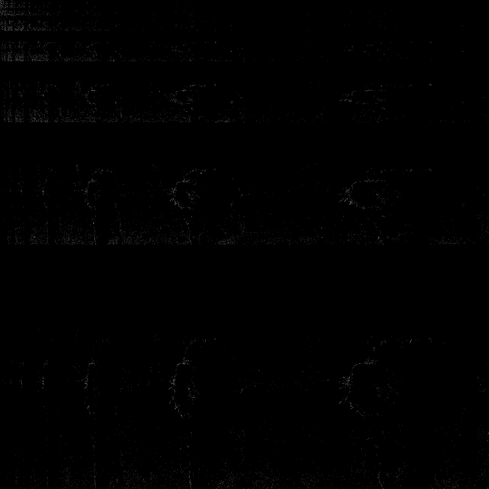
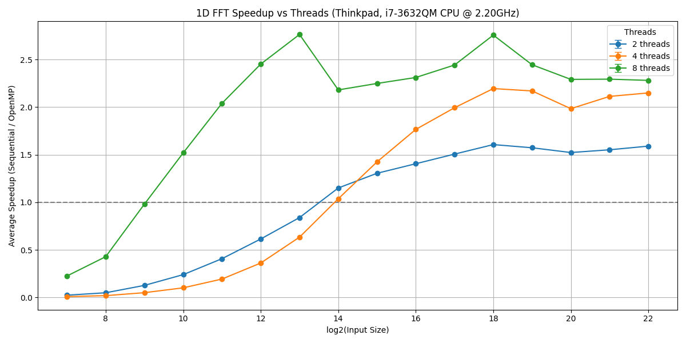

# Signal Processing

## Fast Fourier Transform (FFT) - Group 20

[](https://www.openmp.org/)
[](https://cmake.org/)
[](https://en.cppreference.com/w/cpp/11)
[](LICENSE)

### For the impatient

Only `OpenMP`, `CMake 3.22` and `C++ >= 11` are required to build the library.
- For those who want to use the library:
    ```bash
    git clone --recursive-submodules https://github.com/AMSC-24-25/20-fft-20-fft.git
    # rename folder clone
    mv 20-fft-20-fft signal_processing
    ```
  You can add the following lines to `CMakeLists.txt`:
    ```cmake
    # suppose you have cloned the repository into an external folder
    add_subdirectory(external/signal_processing)
    target_link_libraries(your_executable_name PRIVATE signal_processing)
    ```
- For those who want to run examples or benchmarks:
    ```bash
    git clone --recursive-submodules https://github.com/AMSC-24-25/20-fft-20-fft.git
    # rename folder clone
    mv 20-fft-20-fft signal_processing && cd signal_processing
    ./build-essentials.sh  # to install the dependencies
    ./build-examples.sh    # to build the examples
    ./build-benchmarks.sh  # to build the benchmarks
    ```

---

## Table of Contents

- [Overview](#overview)
- [Getting Started](#getting-started)
  - [Prerequisites](#prerequisites)
  - [Building with CMake Presets](#building-with-cmake-presets)
  - [How to Add `signal_processing` to Your Project](#how-to-add-signal_processing-to-your-project)
- [How to Use the Library](#how-to-use-the-library)
  - [Utils](#utils)
- [Description](#description)
  - [Fourier Transform and Cooley-Tukey Algorithm](#fourier-transform-and-cooley-tukey-algorithm)
  - [Discrete Cosine Transform Type-II (DCT-II) and DCT-III (Inverse DCT)](#discrete-cosine-transform-type-ii-dct-ii-and-dct-iii-inverse-dct)
  - [Haar Wavelet Transform (HWT)](#haar-wavelet-transform-hwt)
- [Examples](#examples)
  - [Fast Fourier Transform (FFT) and Inverse FFT](#fast-fourier-transform-fft-and-inverse-fft)
  - [Haar Wavelet Transform (HWT)](#haar-wavelet-transform-hwt-1)
- [Benchmark](#benchmark)
  - [FFT and Inverse FFT Performance](#fft-and-inverse-fft-performance)


---


## Overview

The Signal Processing library is a C++ educational project implementing famous transform algorithms.

The transforms implemented in this repository are:
- The [Fast Fourier Transform (FFT)](#fourier-transform-and-cooley-tukey-algorithm)
  and its inverse are both implemented in parallel using the [OpenMP framework][OpenMP]
  and in sequential.
  The implementation is based on the [Cooley-Tukey algorithm][CK-FFT].
  It **supports N-dimensional signals**, but obviously the signal length must be a power of 2 (radix-2 case).
- The [Discrete Cosine Transform (DCT)](#discrete-cosine-transform-type-ii-dct-ii-and-dct-iii-inverse-dct)
  and its inverse are both implemented in parallel using the
  [OpenMP framework][OpenMP] and in sequential.
  The DCT is implemented as DCT-II (type II), and its inverse is implemented as DCT-III (type III).
  It is believed to be used for image compression.
- The [Haar Wavelet Transform (HWT)](#haar-wavelet-transform-hwt) (only sequential).

Furthermore, the DCT and the HWT are implemented for image compression.


---


## Getting Started

### Prerequisites

> [!IMPORTANT]  
> The library itself has only been tested on Linux.
> It is not guaranteed to work on other operating systems.
> The benchmarks and examples may not work on Windows.


Clone the repository:
```bash
git clone --recursive-submodules https://github.com/AMSC-24-25/20-fft-20-fft.git
# rename folder clone
mv 20-fft-20-fft signal_processing
```
Now you are ready to go.

However, some prerequisites are very common.
The library is written in C++11 and uses the [OpenMP][OpenMP] framework for parallelization.
In order to use it, you need to have:
- A C++ compiler that supports the C++11 standard.
- Build tools are [CMake](https://cmake.org/) $\ge 3.22$, [Make](https://www.gnu.org/software/make/),
  or [Ninja](https://ninja-build.org/) (strongly recommended).
- The [OpenMP](https://www.openmp.org/) framework.

However, you can run the following script to install the dependencies (**linux only**):
```bash
./build-essentials.sh
```
Keep in mind that if you are a developer,
you may already have the necessary dependencies installed because
build-essential, CMake, and Ninja are very common packages.


> [!NOTE]  
> If you have already cloned the repository without the `--recursive` flag,
> you can clone the submodules using the following command (from the repository folder):
> ```bash
> git submodule update --init --recursive
> ```


---


### Building with CMake Presets

This project uses [CMake Presets](https://cmake.org/cmake/help/latest/manual/cmake-presets.7.html)
to simplify configuration.

To list available presets:

```bash
cmake --list-presets
```

The recommended way to build the library is to use the `ninja-lib` preset.
This preset only builds the library and uses Ninja as the build system.
Therefore, no examples or benchmarks are built.

```bash
# assuming you are in the repository folder where the CMakeLists.txt file is located
# create a build directory
mkdir build && cd build
# configure the project using the ninja-lib preset
cmake .. --preset ninja-lib
cd ninja-lib
# build the project
ninja all
```

Other useful presets:

| Preset Name           | Description                                             |
|-----------------------|---------------------------------------------------------|
| `ninja-dev`           | Build with examples (requires OpenCV and Matplot++)     |
| `ninja-dev-benchmark` | Build with benchmarks (requires Google Benchmark too)   |
| `make-dev`            | Same as `ninja-dev` but uses Makefiles instead of Ninja |
| `make-lib`            | Build library only with Makefiles                       |

The presets are defined in the [CMakePresets.json](CMakePresets.json) file.
The external libraries required for `ninja-dev`, `ninja-dev-benchmark`, and `make-dev`
can be installed using the corresponding scripts:

```bash
./build-examples.sh
./build-benchmarks.sh
```

These scripts will install the dependencies required for the examples and benchmarks, respectively.
However, they also build the examples and benchmarks. You will find the examples and benchmarks in the build folder.


---


### How to Add `signal_processing` to Your Project

If you want to use the library in your own project, you can add the following lines to your `CMakeLists.txt` file:
```cmake
# suppose you have cloned the repository into an external folder
add_subdirectory(external/signal_processing)
target_link_libraries(your_executable_name PRIVATE signal_processing)
```
It will add the library to your project and link it to your executable.
During the build process, it will also automatically issue a warning if some dependencies are missing.


---


## How to Use the Library

The library is designed to be user-friendly.

Simply import the main header file, and you're ready to start using it.

For example, to use the FFT solver, follow these steps:

```cpp
#include <iostream>
#include <cmath>
#include <complex>
#include <vector>

#include <signal_processing/signal_processing.hpp>

int main() {
    // 2D signal, ordered in row-major order
    const size_t dims = 2;
    const size_t rows = 4;
    const size_t cols = 4;
    std::vector<std::complex<double>> rand_signal = {
        {1.0, 0.0},  {2.0, 0.0},  {3.0, 0.0},  {4.0, 0.0},
        {5.0, 0.0},  {6.0, 0.0},  {7.0, 0.0},  {8.0, 0.0},
        {9.0, 0.0}, {10.0, 0.0}, {11.0, 0.0}, {12.0, 0.0},
       {13.0, 0.0}, {14.0, 0.0}, {15.0, 0.0}, {16.0, 0.0}
    };
    // solver, where dims is the number of dimensions and it is a template parameter
    sp::fft::solver::FastFourierTransform<dims> solver(std::array{rows, cols});
    // solve in-place (sequential)
    solver.compute(rand_signal, sp::fft::solver::ComputationMode::SEQUENTIAL);
    // print the result
    for (const auto& s : rand_signal) {
        printf("(%.2f + %.2fi)", s.real(), s.imag());
        // print a new line every 4 elements using the address of the element
        if ((&s - &rand_signal[0] + 1) % 4 == 0) {
            printf("\n");
        } else {
            printf(", ");
        }
    }
}
```

You can also use the parallel version of the FFT solver:

```cpp
solver.compute(rand_signal, sp::fft::solver::ComputationMode::OPENMP);
```

Or solve the FFT not in-place:

```cpp
std::vector<std::complex<double>> result(rand_signal.size());
// rand_signal will not be modified
solver.compute(rand_signal, result, sp::fft::solver::ComputationMode::SEQUENTIAL);
```

To restore the original signal, use the inverse FFT solver:

```cpp
sp::fft::solver::InverseFastFourierTransform<dims> inverse_solver(std::array{rows, cols});
// solve in-place
inverse_solver.compute(rand_signal, sp::fft::solver::ComputationMode::SEQUENTIAL);
// print the result
for (const auto& s : rand_signal) {
    printf("(%.2f + %.2fi)", s.real(), s.imag());
    // print a new line every 4 elements using the address of the element
    if ((&s - &rand_signal[0] + 1) % 4 == 0) {
        printf("\n");
    } else {
        printf(", ");
    }
}
```

Check the [examples](#examples) section for more examples.


### Utils

The library also provides some utility functions to help you with the signal generation and saving.
- The [signal_generator folder](src/signal_processing/handlers/signal_generator)
  contains two classes that generate signals in the time and space domains.
- The [signal_saver folder](src/signal_processing/handlers/signal_saver)
  contains a class that saves the generated signal to a CSV file.
- The [config_loader folder](src/signal_processing/handlers/config_loader)
  contains a class that loads the configuration from a JSON file.
  This class follows the JSON schema defined in the [resources](resources) folder.
  > **Example: JSON Configuration File**
  >
  > ```json
  > {
  >   "signal_domain": "time",
  >   "signal_length": 2048,
  >   "hz_frequency": 5,
  >   "phase": 0,
  >   "noise": 5
  > }
  > ```
  >
  > An example of JSON file that describes a signal with the following characteristics:
  > - **Signal Domain**: `"time"` - The signal is represented in the time domain.
  > - **Signal Length**: `2048` - The duration or length of the signal (number of samples).
  > - **Frequency**: `5 Hz` - The frequency of the signal in Hertz (cycles per second).
  > - **Phase**: `0` - The phase shift of the signal, which is 0 in this case.
  > - **Noise**: `5` - The noise level or amplitude of noise in the signal.
  >
  > In short, the configuration describes a time domain signal with a frequency of `5 Hz`,
  > no phase shift, and an amount of noise (`5`).


---


## Description

### Fourier Transform and Cooley-Tukey Algorithm

The Fourier transform is a mathematical operation that transforms a function of time (or space) into a function of frequency.
In this library, we implement the Fast Fourier Transform (FFT) algorithm,
and its inverse (IFFT) using the Cooley-Tukey algorithm (Radix-2 case).

The **Cooley-Tukey algorithm** is a (famous) algorithm for computing the **Fast Fourier Transform (FFT)** efficiently.
It reduces the computational complexity of the **Discrete Fourier Transform (DFT)** from $O(N^2)$ to $O(N \log N)$,
where $N$ is the number of data points.

Under the hood, the Cooley-Tukey algorithm uses the **divide-and-conquer** strategy.
It recursively breaks a DFT of size $N$ into several smaller DFTs, computes them, and then combines the results.
Precisely, it decomposes a DFT of size $N$ into two smaller DFTs: $N = N_1 \cdot N_2$;
then it reuses the results with **twiddle factors** (complex exponential factors) to combine them:

$$
X(k) = \sum_{n=0}^{N-1} x(n) e^{(-2\pi i k n) \div N} = \sum_{m=0}^{N_1-1} X_1(m) W_N^{km} + \sum_{m=0}^{N_2-1} X_2(m) W_N^{km}
$$

- $X(k)$ is the $k$-th component of the Discrete Fourier Transform (DFT), representing the frequency domain.
- $\displaystyle\sum_{n=0}^{N-1}$ is the summation over all $N$ input samples.
- $x(n)$ is the $n$-th sample of the input signal in the time (or spatial) domain.
- $e^{(-2\pi i k n) \div N} = \exp((-2\pi i k n) \div N)$ is the complex exponential
  (**twiddle factor**) that maps the time-domain signal
  to the frequency domain. It introduces a phase shift and scales the input signal.

When $N$ is a power of 2 ($N = 2^m$), the algorithm becomes very simple and efficient.
And this is the case we implement in this repository. Also called **Radix-2 Cooley-Tukey FFT**.
The algorithm is divided into two main steps:
1. **Bit-reversal permutation**: reorder the input array based on the bit-reversed indices
   (see also [Wikipedia][bit-reversal]).
2. **Iteratively compute FFT**:
  1. Start with 2-point DFTs.
  2. Merge results into 4-point DFTs, then 8-point, and so on, up to $N$-point.

Each stage computes [**butterfly operations**][butterfly],
which involve two elements $a$ and $b$, using a twiddle factor $W\_N^k$.

Finally, for the **inverse FFT**, the algorithm is similar but with a few differences:
1. The **direction of the twiddle factor** in the inverse FFT is reversed.

$$
W_N^{-k} = e^{(2\pi i k) \div N}
$$

2. After computing the inverse FFT using Cooley-Tukey, we **normalize the result**.
   Each element is divided by $N$, the size of the input.

$$
x_n = \frac{1}{N} \sum_{k=0}^{N-1} X_k \cdot e^{(2\pi i kn) \div N}
$$

This scaling ensures that the inverse transform truly inverts the original FFT and restores the original signal.


> [!WARNING]
> The Cooley-Tukey algorithm implemented in this repository is the **Radix-2** case.
> So the signal length must be a power of 2.


---


### Discrete Cosine Transform Type-II (DCT-II) and DCT-III (Inverse DCT)


The **Discrete Cosine Transform Type-II (DCT-II)** is the most commonly used variant of the DCT,
particularly in image and video compression (e.g. JPEG). It is defined as:

$$
X_k = \alpha_k \sum_{n=0}^{N-1} x_n \cos\left(\dfrac{\pi(2n+1)k}{2N}\right), \quad k = 0, 1, ..., N-1
$$

Where:
- $x_n$: input signal (spatial or time domain)
- $X_k$: DCT coefficient (frequency domain)
- $N$: number of input samples
- $\alpha_k$: normalization factor:

$$
\alpha_k =
\begin{cases}
\sqrt{\frac{1}{N}} & \text{if } k = 0 \\
\sqrt{\frac{2}{N}} & \text{if } k > 0
\end{cases}
$$


The cosine argument determines the basis functions. It’s the **heart of the transform**:

- $k$ determines the **frequency** of the cosine wave: higher $k$ means more oscillations.
- $(2n+1)$ causes the cosine to **sample at odd intervals**,
  which makes it suitable for even symmetry extension
  (fundamental for avoiding boundary discontinuities in signals/images).


In other words, the DCT basis functions are cosine waves of increasing frequency.


The summation is an **inner product** between the input signal and the cosine basis function of frequency $k$.
It measures "how much of that frequency" is present in the signal.


Finally, the **normalization factor** $\alpha_k$ ensures **energy preservation** and
makes the transform **orthonormal**:

- $\alpha_0 = \sqrt{\frac{1}{N}}$ gives the DC term (average value) less weight.
- $\alpha_k = \sqrt{\frac{2}{N}}$ for $k > 0$ keeps other frequencies properly scaled.


Finally, the **DCT-III**, which is the inverse of the DCT-II, is defined as:

$$
x_n = \sum_{k=0}^{N-1} \alpha_k X_k \cos\left[\frac{\pi(2n+1)k}{2N}\right]
$$


In general, the DCT is used for compression because it focuses the signal's energy into a few coefficients.
This allows for efficient representation and storage.
In this library, we use DCT-II and DCT-III for image compression.
These methods are supported by [quantization][quantization], [zigzag scanning][zigzag], and [RLE encoding][rle]
(unfortunately [Huffman encoding][Huffman] is not implemented yet).


---


### Haar Wavelet Transform (HWT)

The **1D Haar Wavelet Transform** (HWT) is one of the simplest wavelet transforms.
It is very useful for signal compression (our goal), denoising, and multi-resolution analysis.

The Haar transform converts a sequence of values into **averages and differences**,
capturing both **low-frequency (smooth)** and **high-frequency (detail)** information.

The 1D Haar transform is defined as follows. Given an input vector:

$$
x = [x_0, x_1, x_2, x_3, \dots, x_{N-2}, x_{N-1}]
$$

The transform produces two outputs:
1. **Averages** (_low_-frequency content):

$$
a_i = \frac{x_{2i} + x_{2i+1}}{\sqrt{2}}
$$

2. **Details** (_high_-frequency content):

$$
d_i = \frac{x_{2i} - x_{2i+1}}{\sqrt{2}}
$$


> [!TIP]
> For example, for $x = [4, 6, 10, 12]$:
>
> $$
\begin{aligned}
a_0 &= \frac{4 + 6}{\sqrt{2}} = \frac{10}{\sqrt{2}} \\
a_1 &= \frac{10 + 12}{\sqrt{2}} = \frac{22}{\sqrt{2}} \\
d_0 &= \frac{4 - 6}{\sqrt{2}} = \frac{-2}{\sqrt{2}} \\
d_1 &= \frac{10 - 12}{\sqrt{2}} = \frac{-2}{\sqrt{2}} \\
\end{aligned}
$$
>
> So the Haar transform of `x` is:
>
> $$
\text{HWT}(x) = [a_0, a_1, d_0, d_1] = \left[\frac{10}{\sqrt{2}}, \frac{22}{\sqrt{2}}, \frac{-2}{\sqrt{2}}, \frac{-2}{\sqrt{2}}\right]
$$

Our implementation is a multilevel Haar transform, which means it is recursive.
We apply the transform to the **average coefficients only**, creating a **pyramid of resolutions**.
This is known as the **Haar wavelet decomposition**, and it outputs are:
* low-frequency coefficients (averages)
* high-frequency coefficients (details)


> [!TIP]
> Taking in account the example above, the first level of the Haar transform (level 1) gives:
>
> $$
[\underbrace{a_0, a_1}\_{\text{averages}}, \underbrace{d_0, d_1}\_{\text{details}}] = \left[\frac{10}{\sqrt{2}}, \frac{22}{\sqrt{2}}, \frac{-2}{\sqrt{2}}, \frac{-2}{\sqrt{2}}\right]
$$
>
> Then, you can apply the Haar transform again on the averages from level 1:
>
> $$
\left[\frac{10}{\sqrt{2}}, \frac{22}{\sqrt{2}}\right]
$$
>
> Again, compute average and detail (level 2):
>
> $$
\begin{aligned}
a_{00} &= \frac{\frac{10}{\sqrt{2}} + \frac{22}{\sqrt{2}}}{\sqrt{2}} = \frac{32}{2} = 16 \\
d_{00} &= \frac{\frac{10}{\sqrt{2}} - \frac{22}{\sqrt{2}}}{\sqrt{2}} = \frac{-12}{2} = -6
\end{aligned}
$$
>
> After **2 levels**, we get:
>
> $$
[\underbrace{a_{00}}\_{\text{lowest frequency}}, \underbrace{d_{00}}\_{\text{medium detail}}, \underbrace{d_0, d_1}\_{\text{finest details}}] = [16, -6, -\frac{2}{\sqrt{2}}, -\frac{2}{\sqrt{2}}]
$$
>
> Where $a_{00}$ is the overall average of the signal (very low frequency),
> $d_{00}$ is the change between the first and second halves of the signal (medium detail),
> and $d_0, d_1$ are the local fluctuations (finest details, highest frequencies).
> ```text
> Level 2:      a00          <-- 1 value (most compressed)
>             /    \
> Level 1:  a0      a1       <-- 2 values
>          / \    /  \
> Input:  x0 x1  x2  x3      <-- 4 values
> ```

The **2D Haar Wavelet Transform** is essentially just the 1D version applied twice: first across rows,
then across columns.
Given a 2D matrix (e.g., a grayscale image), we apply the **1D Haar transform** to:

1. Each **row**;
2. Then each **column** of the result.

This gives a decomposition of the image into components that describe **different frequency orientations**.
Finally, we apply the multilevel Haar transform recursively on each block to get a compressed representation.

> [!TIP]
> For example, suppose we have a 4x4 matrix $A$:
>
> $$
A = \begin{bmatrix}
4 & 6 & 10 & 12 \\
4 & 6 & 10 & 12 \\
8 & 10 & 14 & 16 \\
8 & 10 & 14 & 16
\end{bmatrix}
$$
>
> We apply the 1D Haar transform to each row:
>
> $$
\begin{bmatrix}
\frac{4+6}{\sqrt{2}} & \frac{10+12}{\sqrt{2}} & \frac{4-6}{\sqrt{2}} & \frac{10-12}{\sqrt{2}} \\
\frac{4+6}{\sqrt{2}} & \frac{10+12}{\sqrt{2}} & \frac{4-6}{\sqrt{2}} & \frac{10-12}{\sqrt{2}} \\
\frac{8+10}{\sqrt{2}} & \frac{14+16}{\sqrt{2}} & \frac{8-10}{\sqrt{2}} & \frac{14-16}{\sqrt{2}} \\
\frac{8+10}{\sqrt{2}} & \frac{14+16}{\sqrt{2}} & \frac{8-10}{\sqrt{2}} & \frac{14-16}{\sqrt{2}}
\end{bmatrix}
$$
>
> This gives us a new matrix with:
>
> - Left half: row averages
> - Right half: row details
>
> Now we take this result and apply the 1D Haar transform to each column.
> This gives us a final matrix divided into **four blocks**:
> ```text
> [ LL | HL ]
> [----+----]
> [ LH | HH ]
> ```
> Where:
> - `LL`: low frequency in both directions (**approximation**).
> - `HL`: high frequency in rows, low in columns (**horizontal details**).
> - `LH`: low frequency in rows, high in columns (**vertical details**).
> - `HH`: high frequency in both directions (**diagonal details**).


---


## Examples


The examples are located in the [examples](examples) folder.
To build the examples, run the following command:

```bash
./build-examples.sh
```

The examples need the following dependencies:
- [OpenCV](https://opencv.org/) (for image processing)
- [Matplot++](https://alandefreitas.github.io/matplotplusplus/) (for plotting)

### Fast Fourier Transform (FFT) and Inverse FFT

The FFT examples are:
- [fourier_transform_solver](examples/fourier_transform_solver.cpp)
  is the simplest one that shows **how to use the FFT solver with a one-dimensional (1D) signal**.

  It generates a random signal using a JSON configuration file.
  It computes the FFT and IFFT in parallel and sequentially.
  It saves each result in a CSV file and plots the results using Matplot++
  to demonstrate the difference between the FFT and IFFT.
  
- [fourier_transform_solver_image](examples/fourier_transform_solver_image.cpp)
  is an example that shows **how to use the FFT solver with a two-dimensional (2D) signal**.

  This time, instead of generating a random signal,
  we will demonstrate how to load an RGB image from a file and apply the FFT to it.
  The results show that the FFT implementation can handle two-dimensional (2D) signals.
  We verified its correctness by comparing the results with the original image.

  <table>
    <tr>
      <th style="width: 50%">Original Image (2048 x 2048)</th>
      <th style="width: 50%">Image after FFT and IFFT (2048 x 2048)</th>
    </tr>
    <tr>
      <td></td>
      <td></td>
    </tr>
  </table>
- [fourier_transform_solver_performance](examples/fourier_transform_solver_performance.cpp)
  is a simple example that demonstrates the performance of the FFT and inverse FFT algorithms.

  Run it to see the performance of the FFT and inverse FFT algorithms.
  It generates a random signal with 8,388,608 (8 million) samples and computes the FFT and inverse FFT.
- [fourier_transform_solver_video](examples/fourier_transform_solver_video.cpp)
  shows how the FFT solver works well with 3D signals, too.

  It uses the OpenCV library to read a video file and apply the FFT to each frame.
  The input video is RGB, and the output is grayscale. This avoids a long processing time.

  The example video has a resolution of 512 x 1024 and contains 266 frames at 60 fps.
  Since the FFT algorithm is designed to work with signals that are powers of two,
  the video is cropped to 256 frames.
  These frames are reshaped into a 3D signal with dimensions of 512 x 1024 x 256 (134,217,728 samples, or 134 million).

  Note: The converted video on GitHub was compressed to reduce its size.
  The original video is available here: [cats_fft_ifft.mp4](docs/_static/cats_fft_ifft.mp4).

  <table>
    <tr>
      <th style="width: 50%">Original Video (266 frames x 512 x 1024)</th>
      <th style="width: 50%">Video after FFT and IFFT (256 frames x 512 x 1024)</th>
    </tr>
    <tr>
      <td><video src="https://github.com/user-attachments/assets/8dd38d9f-cef8-496b-a359-a059df297024" alt="Original Video"></video></td>
      <td><video src="https://github.com/user-attachments/assets/ce8ea564-b21c-4d06-aa88-1cea8f654dd1" alt="Video after FFT and IFFT"></video></td>
    </tr>
  </table>
- [fourier_transform_solver_video_rgb](examples/fourier_transform_solver_video_rgb.cpp)
  is similar to the previous one, but it uses the RGB color space instead of grayscale.
  
  The FFT is applied to each frame of the video, and the result is saved as a new video file.

  The input and output videos are both RGB.
  The example video has a resolution of 512 x 1024 and contains 266 frames at 60 fps.
  Since the FFT algorithm is designed to work with powers of two, the video is cropped to 256 frames.
  The frames are then reshaped into a 3D signal with dimensions of 512 x 1024 x 256
  (134,217,728 samples, or approximately 134 million).

  Note: The converted video on GitHub was compressed to reduce its size.
  The original video is available here: [cats_fft_ifft-rgb.mp4](docs/_static/cats_fft_ifft-rgb.mp4).

  <table>
    <tr>
      <th style="width: 50%">Original Video (266 frames x 512 x 1024)</th>
      <th style="width: 50%">Video after FFT and IFFT (256 frames x 512 x 1024)</th>
    </tr>
    <tr>
      <td><video src="https://github.com/user-attachments/assets/8dd38d9f-cef8-496b-a359-a059df297024" alt="Original Video"></video></td>
      <td><video src="https://github.com/user-attachments/assets/f361dcca-f860-4a2e-8032-236cdcfcb427" alt="Video after FFT and IFFT"></video></td>
    </tr>
  </table>


---


### Haar Wavelet Transform (HWT)

The Haar Wavelet Transform (HWT) examples are:
- [haar_wavelet_transform_1d](examples/haar_wavelet_transform_1d.cpp)
  is a simple example that shows how to use the Haar wavelet transform (HWT) solver with a one-dimensional signal.

  A similar example is [haar_wavelet_transform_2d](examples/haar_wavelet_transform_2d.cpp).
  This example shows how to use the HWT solver with a two-dimensional (2D) signal.

  Both examples generate a random signal and print the original signal, compute the HWT, and print the result.
- [haar_wavelet_transform](examples/haar_wavelet_transform.cpp)
  is an example that shows how the HWT solver works with a two-dimensional (2D) signal, in this case an image.

  It loads a grayscale image from a file and applies the HWT to it to compress the image.
  Finally, it restores the original image using the inverse HWT and saves it to a file.
  With different levels of compression, the image quality is preserved.

  Compression is modified by adjusting the threshold for detail coefficients.
  This threshold determines which coefficients in the Haar wavelet transform are set to zero during compression.
    - A higher threshold removes more coefficients, resulting in greater compression and loss of detail in the image.
      This can degrade the quality of the reconstructed image.
    - A lower threshold retains more coefficients, preserving more detail but reducing the compression ratio.

  <table>
      <tr>
          <th colspan="2">Original Image (2048 x 2048, 3.17 MB)</th>
      </tr>
      <tr>
          <td colspan="2"></td>
      </tr>
      <tr>
          <th style="width: 50%">Reconstructed Image</th>
          <th style="width: 50%">Haar Wavelet domain</th>
      </tr>
      <tr>
          <th>Threshold = 7.5, 170.17 KB, size reduced by ~95%</th>
          <th>Threshold = 7.5, 78.81 KB</th>
      </tr>
      <tr>
          <td></td>
          <td></td>
      </tr>
      <tr>
          <th>Threshold = 5, 392.33 KB, size reduced by ~88%</th>
          <th>Threshold = 5, 161.2 KB</th>
      </tr>
      <tr>
          <td></td>
          <td></td>
      </tr>
      <tr>
          <th>Threshold = 3, 923.82 KB, size reduced by ~72%</th>
          <th>Threshold = 3, 396.61 KB</th>
      </tr>
      <tr>
          <td></td>
          <td></td>
      </tr>
      <tr>
          <th>Threshold = 2, 1.48 MB, size reduced by ~53%</th>
          <th>Threshold = 2, 682.06 KB</th>
      </tr>
      <tr>
          <td></td>
          <td></td>
      </tr>
      <tr>
          <th>Threshold = 1, 2.37 MB, size reduced by ~25%</th>
          <th>Threshold = 1, 1.26 MB</th>
      </tr>
      <tr>
          <td></td>
          <td></td>
      </tr>
      <tr>
          <th>Threshold = 0.5, 2.96 MB, size reduced by ~7%</th>
          <th>Threshold = 0.5, 1.35 MB</th>
      </tr>
      <tr>
          <td></td>
          <td></td>
      </tr>
  </table>


---


## Benchmark

### FFT and Inverse FFT Performance

We conducted a comprehensive set of benchmarks to evaluate the performance and scalability of our
Fast Fourier Transform (FFT) implementation.
These benchmarks cover 1D, 2D, and 3D FFTs and compare sequential and parallel (OpenMP)
computation modes.

- We generated random input signals of various sizes to ensure that the total number of elements
  was always a power of two, as required by the radix-2 Cooley-Tukey FFT.
- We tested a wide range of input shapes for each dimension, from small to very large,
  to assess performance at both small and large scales.
  
  Using a [backtracking approach](https://en.wikipedia.org/wiki/Backtracking#Description_of_the_method),
  we generated input shapes and benchmarked all possible combinations of sizes
  for each dimension that were less than or equal to 8,388,608 $\left(2^{23}\right)$ elements.
- Each benchmark was run in both sequential and OpenMP parallel modes with different thread counts to measure parallel speedup and efficiency.
- The benchmarks were executed using the [Google Benchmark framework](https://github.com/google/benchmark),
  which provides reliable and statistically sound timing results.

#### ThinkPad T430 Benchmarking Environment

We benchmarked the performance of our FFT implementation on a Lenovo ThinkPad T430:
- **CPU**: Intel(R) Core(TM) i7-3632QM CPU @ 2.20GHz
  - Thread(s) per core:   2
  - Core(s) per socket:   4
  - Socket(s):            1
  - Stepping:             9
  - CPU(s) scaling MHz:   56%
  - CPU max MHz:          3200.0000
  - CPU min MHz:          1200.0000
  - Caches (sum of all):      
    - L1d: 128 KiB (4 instances)
    - L1i: 128 KiB (4 instances)
    - L2:  1 MiB (4 instances)
    - L3:  6 MiB (1 instance)
- **RAM**: 2 x 8 GB DDR3 1600 MHz
- **OS**: Ubuntu 24.04 LTS

<table>
    <tr>
        <th style="width: 50%">1D FFT Speedup</th>
        <th style="width: 50%">1D FFT Efficiency</th>
    </tr>
    <tr>
        <td></td>
        <td></td>
    </tr>
    <tr>
        <td>
          <ul>
            <li>2 threads: Modest speedup, peaks around 1.6x for large sizes ($\log_{2}(N) \ge 18$). Consistent scaling with increasing input.</li>
            <li>4 threads: Speedup exceeds 2x from $\log_{2}(N) \approx 16$. Flatter scaling curve after that, reaching a maximum around 2.2x.</li>
            <li>8 threads: Achieves the highest speedup (up to 2.75x) but is less stable. Sharp drop at $\log_{2}(N) = 14$ suggests overhead or thread contention. Gains taper off, indicating limited scalability beyond this point.</li>
          </ul>
          Speedup improves with input size for all thread counts. 8 threads offer the best speedup, but not proportionally to thread count.
          Scaling is sublinear due to overhead, synchronization, and possibly thermal or hardware constraints.
        </td>
        <td>
          <ul>
            <li>2 threads perform best, reaching up to 80% efficiency for large input sizes ($log_{2}(N) \ge 17$).</li>
            <li>4 threads show moderate scaling, peaking near 55%, but efficiency drops slightly at higher sizes.</li>
            <li>8 threads have poor efficiency (max ~35%), likely due to overhead, thread contention, or hyperthreading limits.</li>
          </ul>
          Efficiency improves with input size but saturates beyond a point.
          More threads don’t always mean better performance, overhead dominates with 8 threads.
          Optimal thread count depends on input size; 2–4 threads offer the best trade-off on Intel i7-3632QM.
        </td>
    </tr>
</table>


[OpenMP]: https://www.openmp.org/
[CK-FFT]: https://en.wikipedia.org/wiki/Cooley%E2%80%93Tukey_FFT_algorithm
[bit-reversal]: https://en.wikipedia.org/wiki/Bit-reversal_permutation
[butterfly]: https://en.wikipedia.org/wiki/Butterfly_diagram
[quantization]: https://en.wikipedia.org/wiki/Quantization_(image_processing)
[zigzag]: https://en.wikipedia.org/wiki/Color_layout_descriptor#Zigzag_scanning
[rle]: https://en.wikipedia.org/wiki/Run-length_encoding
[Huffman]: https://en.wikipedia.org/wiki/Huffman_coding